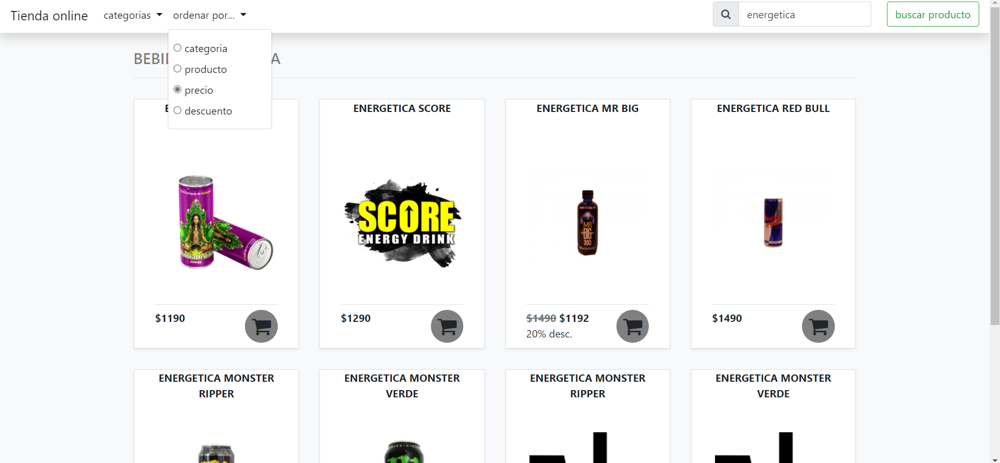

# Fron tienda online

Cliente de la tienda online de la prueba técnica de bsale en donde se encuentra la aplicación web con todos sus componentes visuales tales como los campos de filtro, y el área visual donde se encuentra los productos.

Esta aplicación, tiene el fin de mostrar productos disponibles en la tienda, e interactuar con el usuario para filtrar el o los productos para dar mayor facilidad a la hora de buscar un producto en específico. Como característica de la aplicación web, es responsiva para dispositivos móviles, no se recarga al modificar los filtros y posee una búsqueda en tiempo real (live search) en donde al modificar un campo en los filtros, se actualiza de manera automática.

Esta tienda online funciona mediante API REST que fue desarrollada de manera independientemente para que funcione en esta aplicación, en donde al interactuar con los filtros disponible, realiza peticiones ajax (GET) para obtener y actualizar la vista mediante datos JSON sin recargar la página, y que a su vez cambia la query string de la url para almacenar el estado de la consulta para el usuario, y que, para la facilidad del manejo del cliente y la API, comparten la misma query string.

La demo del cliente se encuentra hospedada en [heroku](https://www.heroku.com/home) haciendo clik [aquí](https://bsale-tech-demo-front-daniel-t.herokuapp.com/)

## Instalación y ejecución del servidor


instalar las dependencias.
```
npm install
```

iniciar servidor con el siguente comando

```
npm start
```

Esta inicia en el puerto 8080 tanto en localHost como en tu red local para probar con otros dispositivos, en otras palabras, se abre en http://127.0.0.1:8080 y http://*<red_interna>*:8080

## uso

Al iniciar la aplicación, ésta se divide dividida en dos secciones. En la parte superior se encuentra el campo de busqueda, el filtro de categorías y el selector de ordenamiento de productos además de la página de inicio o "home" y el boton de buscar, y en la parte inferior se muestran los productos retornados por la API con su respectivo nombre, imagen, precio y posible descuento, además de un boton de compra en donde actualmente no tiene una funcionalidad definida.

Por cada cambio que se ralice en la búsqueda de productos, se almacenará los resultados en el navegador en donde en el caso de retroceder a una página anterior, puede recuperar las consultas pasadas, la cual además quedan registradas en la url para un acceso directo a una búsqueda específica.


